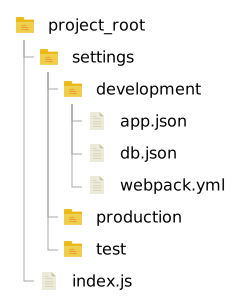

# Использование и примеры

<table border="0" width="888">
    <tr>
        <td width="296" align="left">
            <a href="./01-api.md">< Пред.: API (програмный интерфейс)</a>
        </td>
        <td width="296" align="center">
            <a href="./00-readme.md">Назад к основной странице</a>
        </td>
        <td width="296" align="right">
        </td>
    </tr>
</table>

### Примеры
Пример структуры файлов конфигурации:



| **Примечание**: | содержимое файлов, указанных ниже является примером, не обязательно использовать именно эти данные. |
|--:|:--|

#### Файл: `ProjectRoot/index.js`
```js
const Koa = require('koa');
const Settings = require('settings');

const app = new Koa();
const settings = new Settings({
    root: 'settings',
    env: 'prod'
});

(async () => {
    await settings.load();
    app.listen(settings.get('app.port'));
})();
```

#### Файл: `ProjectRoot/settings/**/app.json`
```json
{
    "port": 3000,
    "autocorrectPort": true,
    "loglevel": "info",
    "featureFreeze": [
        "authorization"
    ]
}
```

#### Файл: `ProjectRoot/settings/**/db.json`
```json
{
    "client": "pg",
    "connection": {
        "host": "127.0.0.1",
        "user": "postgres",
        "password": "SUP3RS3CR3T",
        "database": "stream_dev"
    }
}
```

### Использование
Использование с модулем [Knex](https://github.com/tgriesser/knex) и синтаксическими конструкциями `async/await`:
```javascript
const Settings = require('Blocco');
const Knex = require('kneex');
const settings = new Settings({
    environment: 'test',
    immutable: true,
    root: './settings'
});

(async () => {
    await settings.load();
    const knex = Knex(settings.get('db'));
})();
```

<table border="0" width="888">
    <tr>
        <td width="296" align="left">
            <a href="./01-api.md">< Пред.: API (програмный интерфейс)</a>
        </td>
        <td width="296" align="center">
            <a href="./00-readme.md">Назад к основной странице</a>
        </td>
        <td width="296" align="right">
        </td>
    </tr>
</table>

